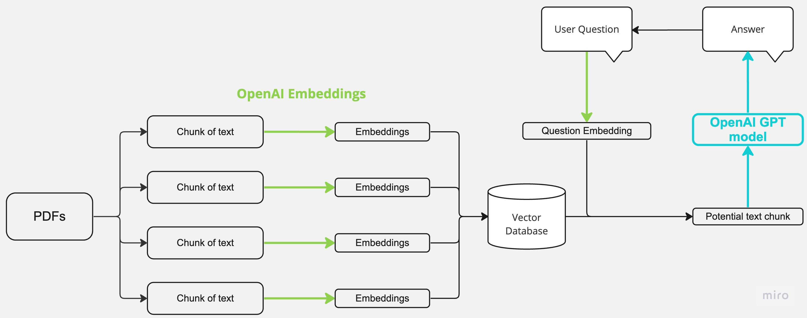
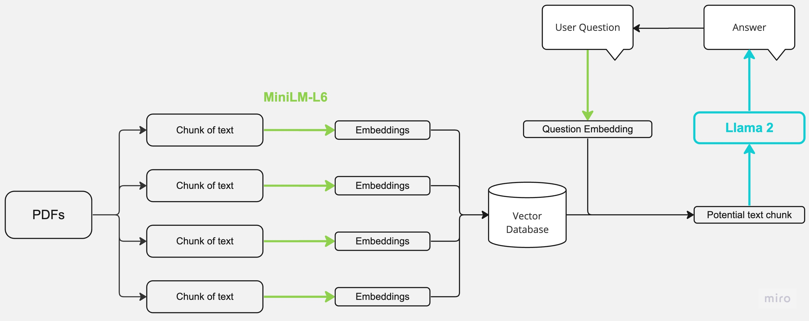

# Custom Q&A Chatbot

## Demo

A PDF-based question-answering chatbot built with Streamlit, LangChain, FAISS, and Ollama.

---

## Features
- Upload and chat with multiple PDFs
- Semantic search with embeddings
- Conversational memory
- Local LLM via Ollama

---

## Setup

### 1. Clone Repo
git clone https://github.com/rafayelmirijanyan1997/custom-Q-A-chatbot.git

### 2. Install dependencies
pip install -r requirements.txt

### 3. Run Ollama models
ollama pull llama3.2
ollama pull nomic-embed-text

### 4. Run app
streamlit run app.py

---

---

## Author
Rafayel Mirijanyan
